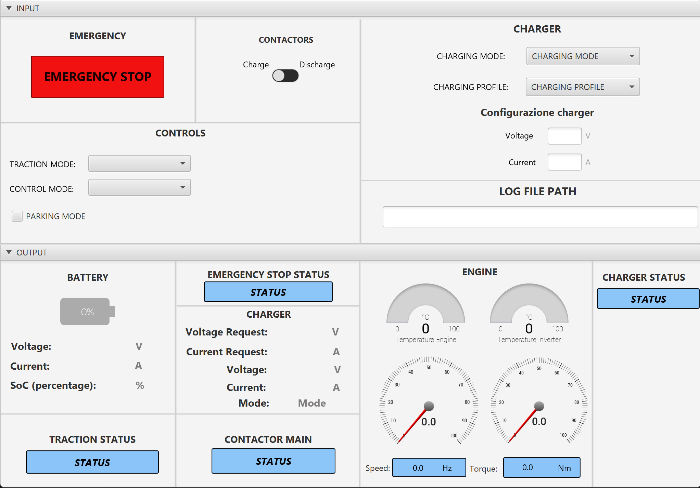

# PowerTrain Monitoring and Control GUI

## Overview

This Java application provides a Graphical User Interface (GUI) for monitoring and controlling a PowerTrain associated with an electric vehicle. The controllable elements include the engine, Vehicle Control Unit (VCU), charger, inverter, and battery. We used a Peak System PCAN-USB adapter for facilitating communication with external devices and systems.

## Simulation Details

The simulation involves sending packets with an ID and an 8-byte data array. These packets are received and interpreted to communicate with the interface accurately.

---
## User Interface

---

### Input Section

In the input section, users can configure the following parameters:

- Traction Mode (forward (sport), forward (eco), reverse)
- Control Mode (speed or torque)
- Parking Mode (enabled or disabled)
- Charging Mode (GRID or RES)
- Charging Profile (Constant current or Custom Profile)
- Set voltage and current thresholds
- Contactor status (open and closed)
- Emergency Stop button

---

### Output Section

In the output section, users can observe the PowerTrain's actual behavior. The output section includes:

#### Battery Section:

- Charge status with a Battery Skin (%)
- Voltage (V)
- Current (A)

#### Charger Section:

- Voltage (V)
- Current (A)
- Mode (GRID or RES)

#### Engine Section:

- Speed (Hz)
- Torque (Nm)
- Engine Temperature (°C)
- Inverter Temperature (°C)
- Traction status
- Emergency Stop Status (enabled or disabled)
- Contactor status
---
## Error Handling

If the PCAN-USB adapter is not connected to the PC, the entire input screen is disabled, and an error alert is generated in case the connection fails.

---

## Data Logging

---

The application generates a file in .csv format containing a summary of received messages. The log includes information on:

- Timestamp
- RPM Calculation Frequency (HZ)
- Real Current (A)
- Motor Temperature (°C)
- Inverter Temperature (°C)
- Battery Current (A)
- Battery Voltage (V)
- Control Mode
- Fault Code
---
## Dependencies

- Java 21 
- Peak System PCAN-USB adapter

---
## Contributors

- noemi.latorre@studentmail.unicas.it
- nunziamaria.colacicco@studentmail.unicas.it
- gianmarco.luongo@studentmail.unicas.it
