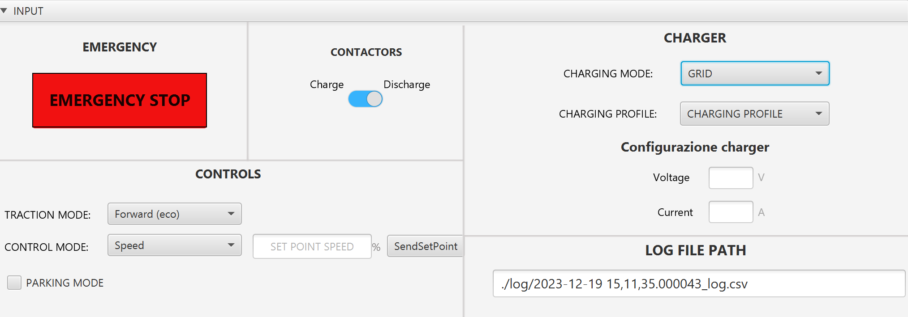
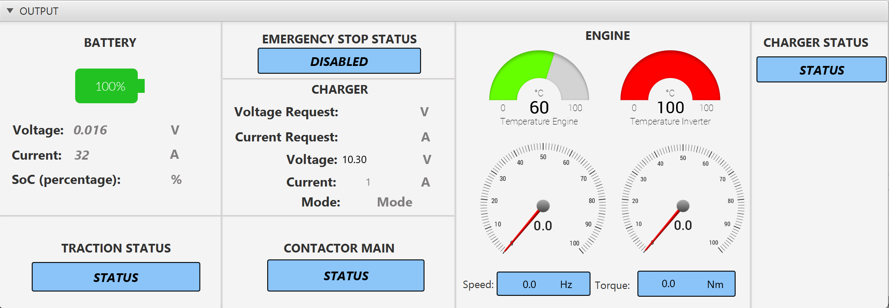
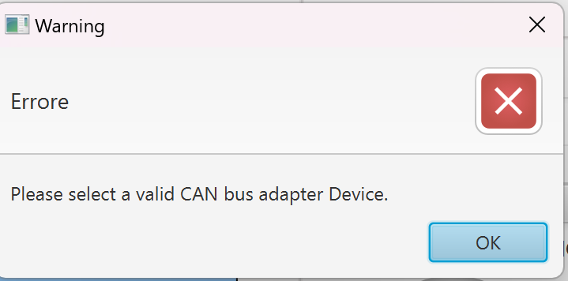
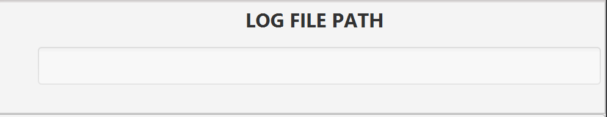

# PowerTrain Monitoring and Control GUI

Applicazione Java con interfaccia grafica per il monitoraggio e controllo di un PowerTrain per veicoli elettrici. Il sistema utilizza un adattatore PCAN-USB per la comunicazione CAN bus con i componenti del powertrain.

## Panoramica

Applicazione Java che fornisce un'interfaccia grafica per il monitoraggio e controllo di un PowerTrain per veicoli elettrici. I componenti controllabili includono:

- **Motore**
- **VCU** (Vehicle Control Unit)
- **Caricatore**
- **Inverter**
- **Batteria**

### Comunicazione CAN Bus
La simulazione prevede l'invio di pacchetti con ID e array di dati a 8 byte, ricevuti e interpretati per comunicare accuratamente con l'interfaccia.

---

## Interfaccia Utente

**Parametri configurabili:**
- **Modalità Trazione**: avanti (sport), avanti (eco), retromarcia
- **Modalità Controllo**: velocità o coppia
- **Modalità Parcheggio**: abilitata/disabilitata
- **Modalità Ricarica**: GRID o RES
- **Profilo Ricarica**: corrente costante o profilo personalizzato
- **Soglie** tensione e corrente
- **Stato contattore**: aperto/chiuso
- **Pulsante Arresto Emergenza**

### Sezione Output

**Monitoraggio in tempo reale:**

#### Batteria:
- Stato carica con indicatore visivo (%)
- Tensione (V)
- Corrente (A)

#### Caricatore:
- Tensione (V)
- Corrente (A)
- Modalità (GRID o RES)

#### Motore:
- Velocità (Hz)
- Coppia (Nm)
- Temperatura motore (°C)
- Temperatura inverter (°C)
- Stato trazione
- Stato arresto emergenza
- Stato contattore

---

## Gestione Errori

In caso di mancata connessione dell'adattatore PCAN-USB:
- **Disabilitazione completa** della schermata di input
- **Generazione alert** di errore per connessione fallita

---

## Data Logging

Generazione automatica di file **.csv** contenente il riepilogo dei messaggi ricevuti:

**Campi registrati:**
- Timestamp
- Frequenza calcolo RPM (Hz)
- Corrente reale (A)
- Temperatura motore (°C)
- Temperatura inverter (°C)
- Corrente batteria (A)
- Tensione batteria (V)
- Modalità controllo
- Codice errore

---

## Tecnologie

- **Linguaggio**: Java 21
- **Comunicazione**: Adattatore PCAN-USB Peak System
- **Protocollo**: CAN Bus
- **Output**: File CSV per data logging

---

## Collaboratori

**Noemi La Torre**
- Email: noemi.latorre@studentmail.unicas.it
- GitHub: [github.com/noemilatorre](https://github.com/noemilatorre)

**Nunziamaria Colacicco**
- Email: nunziamaria.colacicco@studentmail.unicas.it

**Gianmarco Luongo**
- Email: gianmarco.luongo@studentmail.unicas.it

---

*Progetto sviluppato per E-Lectra Challenge 2024 in collaborazione con E-Lectra s.r.l.*
